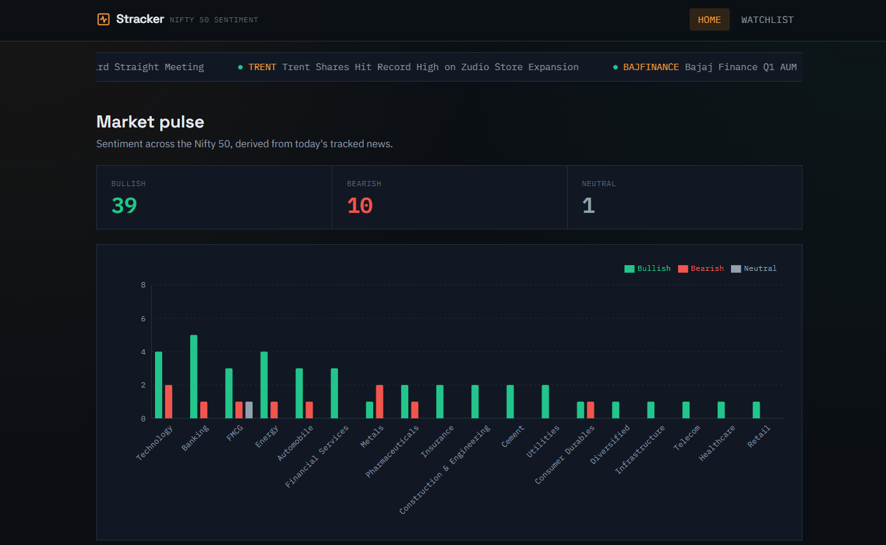

# Stracker — Nifty 50 News Sentiment Tracker

A full-stack project that ingests financial news, runs it through an
LLM for sentiment classification and impact summaries, stores it in
Postgres/pgvector via Supabase, and serves it through a Next.js
dashboard.

> **Portfolio project** — built to demonstrate an end-to-end AI +
> full-stack pipeline, not a live financial product. News is processed
> in batches via a manual script, not streamed in real time.

<!-- Add a screenshot or short GIF of the dashboard here before publishing.
     e.g.  -->

## What it does

- **Ingests** news articles and classifies each one as `BULLISH`,
  `BEARISH`, or `NEUTRAL` using Google Gemini, with a 2-sentence
  AI-generated impact summary per article.
- **Stores** everything in Supabase (Postgres), with a normalized
  schema (`stocks`, `articles`, `watchlists`) and a `pgvector` column
  for future semantic search.
- **Serves** a dashboard with:
  - a **Home** feed of high-impact macro/policy news and a
    sentiment-by-sector chart,
  - a **Watchlist** page to filter news by multiple stocks or a single
    sector.

## Architecture

```
stracker_news.json ──▶ scripts/process_news.ts ──▶ Gemini API (sentiment + summary)
                                    │
                                    ▼
                          Supabase (Postgres + pgvector)
                                    │
                                    ▼
                     stracker-web (Next.js dashboard) ──▶ browser
```

## Tech stack

`Next.js` · `TypeScript` · `Tailwind CSS` · `Supabase (Postgres, pgvector)` ·
`Google Gemini API` · `Recharts`

## Repo structure

```
Stracker/
├── scripts/                  # ingestion pipeline
│   ├── process_news.ts       # main pipeline: filter → analyze → embed → upsert
│   └── list_models.ts        # debug helper: lists available Gemini models
├── stracker_schema.sql       # Supabase schema (tables, RPC, seed data)
├── stracker_news.json        # sample input dataset
├── package.json               # pipeline dependencies
├── README.md                  # you are here
└── stracker-web/              # the dashboard (separate Next.js app)
    ├── app/
    ├── components/
    ├── lib/
    └── README.md               # frontend-specific setup instructions
```

## Setup

This is two small apps sharing one Supabase project — set up in this order:

### 1. Database

Run `stracker_schema.sql` in the Supabase SQL editor for your project.
This creates the `stocks`, `articles`, and `watchlists` tables, the
`match_articles` semantic-search RPC, and seeds the `stocks` table.

### 2. Ingestion pipeline

```bash
npm install
cp .env.example .env   # fill in GEMINI_API_KEY, SUPABASE_URL, SUPABASE_SERVICE_ROLE_KEY
npm run process-news
```

Populates `articles` with sentiment, impact summaries, and embeddings.
See inline comments in `scripts/process_news.ts` for tuning options
(concurrency, rate-limit pacing, article limits for testing).

### 3. Dashboard

```bash
cd stracker-web
npm install
cp .env.local.example .env.local   # same Supabase project
npm run dev
```

Full details in [`stracker-web/README.md`](./stracker-web/README.md).

## Notable engineering details

- **Idempotent ingestion** — the upsert is keyed on `(title, published_at)`,
  so re-running the pipeline never creates duplicates.
- **Resilient to API flakiness** — retries honor the rate-limit provider's
  own suggested backoff window rather than guessing.
- **FK-safe by design** — articles referencing an unrecognized ticker get
  gracefully nulled with a warning instead of failing the whole batch.
- **No secrets in the client** — the dashboard's Supabase service-role
  key lives server-side only (API routes + Server Components); the
  browser never sees it.

## License

MIT — see [`LICENSE`](./LICENSE).
